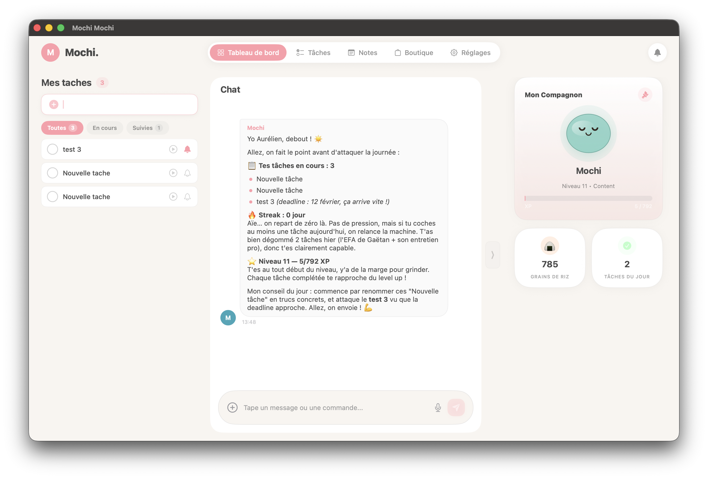

<p align="center">
  
  
  
  
</p>

<h1 align="center">🍡 Mochi Mochi</h1>

<p align="center">
  <strong>L'assistant IA qui ne t'oublie jamais.</strong><br>
  <em>App macOS native • Compagnon virtuel gamifié • Mémoire persistante • Propulsé par Claude Code</em>
</p>

<p align="center">
  <a href="#-démarrage-rapide">Démarrage rapide</a> •
  <a href="#-le-compagnon-mochi">Le Mochi</a> •
  <a href="#-gamification">Gamification</a> •
  <a href="#-personnalités">Personnalités</a> •
  <a href="#-intégration-notion">Notion</a>
</p>

<p align="center">
  
</p>

---

## Le problème

Les assistants IA actuels souffrent d'amnésie chronique. Chaque conversation repart de zéro. Vous répétez sans cesse votre contexte, vos objectifs, vos préférences.

**[ULY](https://github.com/aamsellem/uly)** a résolu ce problème avec une mémoire persistante en Markdown — mais il reste cantonné au terminal.

## La solution : Mochi Mochi

Mochi Mochi reprend le concept d'ULY et l'enveloppe dans une **application macOS native** avec une identité forte : un compagnon virtuel attachant qui vous accompagne au quotidien.

- 🍡 **Compagnon animé** — Un Mochi vivant qui réagit à votre productivité, cligne des yeux et vous encourage
- 🧠 **Mémoire persistante** — Il se souvient de tout, session après session (fichiers Markdown locaux)
- 🎮 **Gamification** — XP, niveaux, grains de riz 🍙, boutique cosmétique
- 🎭 **8 personnalités** — Du Mochi Kawaii au Mochi Butler, choisissez votre style
- 📋 **Gestion de tâches** — Suivi intelligent avec relances personnalisées
- 📎 **Upload de documents** — Joignez des fichiers (PDF, code, texte) au chat
- 🎤 **Dictée vocale** — Parlez au lieu de taper grâce à la reconnaissance vocale
- 📝 **Notes rapides** — Prise de notes avec extraction automatique de tâches via IA, indicateur de sauvegarde en temps réel
- 📅 **Veille de réunions** — Détection Outlook + Notion, préparation automatique via IA, vue Kanban, exclusions configurables
- 🔗 **Sync Notion** — Bidirectionnelle, vos tâches partout
- 🖥️ **Menubar** — Icône mochi avec compteur de tâches, accès rapide sans quitter votre travail
- 🏠 **Données locales** — Vos données sont stockées localement en Markdown (les messages transitent par Claude Code via votre abonnement Anthropic)
- 🔄 **Mises à jour automatiques** — Sparkle 2 intégré : vérification et installation automatiques des nouvelles versions

---

## ⚡ Démarrage rapide

### Prérequis

- macOS 14 (Sonoma) ou supérieur
- [Claude Code](https://docs.anthropic.com/en/docs/claude-code) installé et authentifié
- Un abonnement Anthropic (Max ou Pro) — l'app utilise votre abonnement existant, pas de coût supplémentaire

### Installation (DMG)

1. Téléchargez le fichier **MochiMochi.dmg** depuis les [Releases GitHub](https://github.com/aamsellem/mochi-mochi/releases)
2. Ouvrez le DMG et glissez **Mochi Mochi** dans votre dossier Applications
3. Au premier lancement, macOS peut afficher un avertissement "développeur non identifié" :
   - Allez dans **Réglages Système → Confidentialité et sécurité** et cliquez sur **Ouvrir quand même**
4. Lancez Mochi Mochi et suivez l'onboarding

### Installation (depuis les sources)

```bash
# 1. Cloner le repo
git clone https://github.com/aamsellem/mochi-mochi.git && cd mochi-mochi

# 2. Générer le projet Xcode (nécessite XcodeGen : brew install xcodegen)
xcodegen generate

# 3. Ouvrir dans Xcode
open MochiMochi.xcodeproj

# 4. Build & Run (⌘R)
```

---

## 🍡 Le compagnon Mochi

Votre Mochi est un personnage rond, inspiré des mochis japonais, qui vit dans votre app et réagit à tout ce que vous faites.

### États émotionnels

| État | Déclencheur | Animation |
|------|-------------|-----------|
| 💬 **Idle** | Aucune interaction récente | Clignements des yeux, messages d'encouragement selon la personnalité |
| 😊 **Content** | Tâche complétée, streak maintenu | Sourire, petits bonds, étoiles |
| 🤩 **Excité** | Level up, nouveau record | Sautille vivement, confettis |
| 🧐 **Concentré** | Mode focus activé | Regard déterminé, bulle de concentration |
| 😴 **Endormi** | Pas d'activité / heure tardive | Yeux fermés, Zzz |
| 😰 **Inquiet** | Deadlines proches, tâches en retard | Goutte de sueur |
| 😢 **Triste** | Streak perdu, longue absence | Regard baissé, petite larme |
| 🦸 **Fier** | Semaine productive, objectif atteint | Pose héroïque, aura dorée |

### Personnalisation

Équipez votre Mochi d'items cosmétiques gagnés en boutique :
- **Couleurs** : blanc, rose, vert matcha, bleu ciel, doré, gris, noir, bleu nuit, violet, pride (arc-en-ciel)...
- **Chapeaux** : béret velours, couronne scintillante, casquette brodée, chapeau de sorcier étoilé, bandeau ninja...
- **Accessoires** : lunettes dorées avec reflet, écharpe animée, nœud papillon satin, cape galaxie, ailes éthérées, boule de voyante...
- **Décors** : jardin zen, bureau cosy, espace, forêt de bambous...

---

## 🎮 Gamification

### Double système de progression

**XP & Niveaux** — Votre Mochi évolue avec vous :

| Action | XP |
|--------|-----|
| Tâche simple complétée | +10 XP |
| Tâche moyenne complétée | +25 XP |
| Tâche difficile complétée | +50 XP |
| Complétée avant deadline | +10 XP bonus |
| Objectif long terme atteint | +100 XP |
| Streak quotidien | +5 XP × jours |

**Grains de riz 🍙** — Monnaie pour la boutique cosmétique :
- Gagnés en complétant des tâches et en maintenant des streaks
- Dépensables dans la boutique pour personnaliser votre Mochi
- Items de 10 🍙 (couleur simple) à 200 🍙 (décor rare)

### Streaks 🔥

Complétez au moins 1 tâche par jour pour maintenir votre streak.
Paliers bonus à 7, 14, 30, 60 et 100 jours.
Configurez des jours off (week-ends) qui ne cassent pas le streak.

---

## 🎭 Personnalités

| Personnalité | Style | Exemple |
|-------------|-------|---------|
| 🍡 **Mochi Kawaii** | Doux, encourageant, émojis | *"Tu as fini 3 tâches ! Je suis tellement fier de toi~ ✨🎉"* |
| 🔥 **Mochi Sensei** | Strict mais bienveillant | *"3 tâches c'est bien. Mais tu en avais prévu 5. On reprend."* |
| 🍻 **Mochi Pote** | Décontracté, sarcastique gentil | *"Eh bro, cette tâche traîne depuis 4 jours. On en parle ?"* |
| 🎩 **Mochi Butler** | Poli, british, pince-sans-rire | *"Monsieur a 7 tâches en retard. Dois-je préparer vos excuses en PDF ?"* |
| 🏈 **Mochi Coach** | Motivateur, énergie max | *"ALLEZ ON LÂCHE RIEN ! 2 tâches et c'est fini, LET'S GO !"* |
| 🔮 **Mochi Voyante** | Mystique, énigmatique, lit dans les astres | *"Les cartes me révèlent que cette tâche est cruciale... Les astres s'alignent."* |
| 🐱 **Mochi Chat** | Capricieux, condescendant | *"Je daigne te rappeler ta deadline. Mais c'est bien parce que tu me nourris."* |
| ⚔️ **Mochi Héroïque** | Narrateur épique | *"Le valeureux héros fait face à 4 tâches au donjon !"* |

**La personnalité change le ton, pas les fonctionnalités.** Changez à tout moment via `/humeur` ou les réglages.

---

## 💬 Commandes

| Commande | Action |
|----------|--------|
| `+` (bouton) | Joindre un fichier (PDF, texte, code, image) |
| 🎤 (bouton) | Dictée vocale (reconnaissance fr_FR en temps réel) |
| `/bonjour` | Briefing du jour : tâches, deadlines, streak |
| `/add [texte]` | Ajouter une tâche rapidement |
| `/bilan` | Résumé de la journée ou semaine |
| `/focus` | Mode concentration (désactive les relances) |
| `/pause` | Mettre en pause le suivi |
| `/objectif` | Gérer les objectifs long terme |
| `/humeur` | Changer de personnalité |
| `/inventaire` | Voir les items cosmétiques |
| `/boutique` | Acheter des items avec les 🍙 |
| `/stats` | Statistiques de productivité |
| `/notion` | Forcer une synchronisation Notion |
| `/settings` | Ouvrir les réglages |
| `/help` | Aide |
| `/end` | Fin de session, sauvegarde et résumé |

Toutes les commandes peuvent aussi être exprimées en langage naturel.

---

## ⌨️ Raccourcis clavier

| Raccourci | Action |
|-----------|--------|
| `⌘⇧M` | Ouvrir/fermer la fenêtre de chat (global) |
| `⌘⇧N` | Ouvrir le mini-panel menubar (global) |
| `⌘⇧A` | Ajout rapide de tâche (global) |
| `⌘1` / `⌘2` | Onglet Chat / Dashboard |
| `⌘,` | Réglages |

Tous les raccourcis globaux sont configurables.

---

## 📅 Veille de réunions

Mochi Mochi scanne automatiquement vos réunions Outlook et Notion, les prépare et vous propose des tâches concrètes :

- **Double source** — Outlook (calendrier via MCP Microsoft 365) + Notion (comptes-rendus via MCP Notion)
- **Préparation automatique** — Chaque réunion Outlook découverte est automatiquement préparée par Claude Code (recherche de contexte Notion, création de pages Préparation et Réunion, suggestions de tâches)
- **Vue Kanban** — Board horizontal avec colonnes : En préparation, Préparées, Notes à traiter, Traitées, Ignorées (colonnes masquées si vides)
- **Source Notion configurable** — Cherchez dans tout le workspace Notion ou ciblez une base de donnees specifique (Reglages > Reunions)
- **Base de preparations Notion** — Les preparations de reunions sont stockees dans une base Notion dediee (creee automatiquement ou configurable dans Reglages > Reunions)
- **Tri chronologique** — Les reunions sont triees par date la plus proche en premier
- **Exclusions configurables** — Patterns regexp dans Reglages > Reunions pour ignorer automatiquement certaines reunions (ex: Sport, GYMINNO). Bouton "Ignorer" avec choix : ignorer cette reunion ou exclure les futures similaires
- **Validation en un clic** — Acceptez, rejetez ou ignorez les suggestions depuis le detail de chaque reunion
- **Notifications proactives** — Soyez alerté avec le nom de la réunion dès qu'elle est détectée ou préparée
- **Horaires détaillés** — Chaque carte affiche la date relative et les heures de début/fin de la réunion
- **Recherche** — Recherchez par titre, participant ou tâche

Activable dès l'onboarding ou dans Réglages > Réunions.

---

## 🔗 Intégration Notion

Synchronisation bidirectionnelle avec Notion :

- **Mochi → Notion** : tâches créées/modifiées dans Mochi répliquées dans Notion
- **Notion → Mochi** : tâches créées/modifiées dans Notion importées dans Mochi
- Sync automatique toutes les 5 minutes (configurable)
- Sync manuelle via `/notion`

### Configuration

1. Configurez les outils MCP Notion dans Claude Code
2. Activez la veille de réunions dans les réglages de Mochi Mochi

---

## 🗂️ Structure des données

```
~/.mochi-mochi/
├── config.md              # Configuration (personnalité, nom, préférences)
├── state/
│   ├── current.md         # Tâches et priorités actuelles
│   ├── goals.md           # Objectifs long terme
│   ├── mochi.md           # État du Mochi (niveau, XP, 🍙, streak, items)
│   └── meetings.md        # Propositions de réunions détectées
├── attachments/            # Fichiers joints au chat
├── sessions/
│   └── 2026-02-06.md      # Sessions quotidiennes
├── content/
│   ├── notes/             # Notes libres
│   └── ideas/             # Idées capturées
├── inventory/
│   └── items.md           # Items débloqués et équipés
└── integrations/
    └── notion/
        ├── config.md      # Configuration Notion
        └── sync-log.md    # Journal de synchronisation
```

**Tout est en Markdown. Tout est local. Tout vous appartient.**

---

## 🏗️ Architecture

```
┌──────────────────────────────────────────────────┐
│                  Mochi Mochi App                 │
│                                                  │
│  ┌──────────┐  ┌──────────────┐  ┌───────────┐  │
│  │ Menubar  │  │  Chat Window │  │ Dashboard │  │
│  │ Mini-Panel│  │  + Mochi     │  │           │  │
│  └────┬─────┘  └──────┬───────┘  └─────┬─────┘  │
│       └───────────────┼────────────────┘         │
│              ┌────────▼────────┐                 │
│              │  Command Engine │                 │
│              └────────┬────────┘                 │
│         ┌─────────────┼─────────────┐            │
│  ┌──────▼──────┐ ┌────▼────┐ ┌─────▼─────┐      │
│  │ Claude Code │ │  Local  │ │  Notion   │      │
│  │ (Process)   │ │  (.md)  │ │  (API)    │      │
│  └─────────────┘ └─────────┘ └───────────┘      │
└──────────────────────────────────────────────────┘
```

---

## 🛠️ Développement

### Prérequis

- Xcode 15+
- [XcodeGen](https://github.com/yonaskolb/XcodeGen) : `brew install xcodegen`
- [Claude Code](https://docs.anthropic.com/en/docs/claude-code) installé et authentifié
- Un abonnement Anthropic (Max ou Pro)

### Structure du code

```
MochiMochi/
├── App/                    # Point d'entrée et configuration
├── Models/                 # Modèles de données
├── Views/                  # Vues SwiftUI
│   ├── Chat/              # Interface de chat
│   ├── Dashboard/         # Tableau de bord
│   ├── Mochi/             # Compagnon animé (panneau rétractable)
│   ├── Notes/             # Notes rapides + extraction de tâches IA
│   ├── Meetings/          # Veille de réunions Notion
│   ├── MenuBar/           # Mini-panel menubar
│   ├── Onboarding/        # Assistant de configuration
│   ├── Shop/              # Boutique cosmétique
│   └── Settings/          # Réglages
├── Services/              # Services métier
├── Engine/                # Moteur de commandes
└── Persistence/           # Stockage Markdown et Keychain
```

---

## 📋 Roadmap

- [x] **Phase 1 — MVP (v0.1)** : Chat + Claude Code + mémoire Markdown + Mochi statique
- [x] **Phase 2 — Gamification (v0.2)** : XP, niveaux, 🍙, boutique, animations, dashboard, 11 couleurs, clignement des yeux, messages idle
- [x] **Phase 2.5 — Chat enrichi (v0.2.5)** : Upload de documents (PDF, texte, code), dictée vocale (fr_FR), pièces jointes dans les messages
- [x] **Phase 2.7 — Notes & suivi (v0.2.7)** : Onglet Notes avec extraction de tâches IA, panneau Mochi rétractable, suivi de tâches (tracked) avec relances répétées, refonte TodaysFocus
- [x] **Phase 2.8 — Polish UX (v0.2.8)** : Auto-greeting au lancement, date picker graphique pour les tâches, étape notifications dans l'onboarding, sélection de texte rose personnalisée, nettoyage interface chat
- [x] **Phase 2.9 — Profil libre (v0.2.9)** : Champ activité/métier en texte libre (onboarding + réglages), sélection rose dans les réglages via MochiTextField
- [x] **Phase 3.0 — Boutique & Réunions (v0.3.0)** : Refonte boutique avec inventaire intégré, veille de réunions Notion (détection automatique, suggestions IA, validation, recherche/tri), onboarding 9 étapes avec activation veille
- [x] **Phase 4.0 — Réunions proactives (v0.4.0)** : Préparation automatique des réunions Outlook, vue Kanban horizontale (5 colonnes), patterns d'exclusion regexp, statut "ignoré", dialogue ignorer/exclure
- [x] **Phase 4.1 — Polish réunions (v0.4.1)** : Parsing de dates robuste (MS Graph), suppression filtre par source, affichage horaires début/fin sur les cartes, nettoyage avatar Mochi
- [x] **Phase 4.2 — Polish accessoires & notes (v0.4.2)** : Refonte visuelle de tous les accessoires avec animations (TimelineView, gradients, particules), nouvel item boule de voyante, indicateur de sauvegarde sur les notes
- [x] **Phase 4.3 — Notifications & status bar (v0.4.3)** : Nettoyage complet des notifications (purge delivered + pending), titres de réunions dans les notifications, icône mochi custom dans la status bar avec compteur de tâches actives, purge automatique des tâches complétées >7j, fix du système de streak
- [x] **Phase 4.4 — Onboarding fix (v0.4.4)** : Fix alerte notifications bloquante pendant l'onboarding, ajout étape de configuration du répertoire de stockage (onboarding 10 étapes), détection de configuration existante
- [x] **Phase 4.5 — Source Notion (v0.4.5)** : Filtrage des notes Notion par base spécifique (picker segmenté tout le workspace / base spécifique dans Réglages > Réunions), persistance dans config.md, prompt conditionnel notion-search vs notion-fetch
- [x] **Phase 4.6 — Sparkle & préparations (v0.4.6)** : Mises à jour automatiques via Sparkle 2 (clé EdDSA, appcast, onglet Réglages), base Notion dédiée pour les préparations de réunions (auto-création), tri des réunions par date la plus proche
- [ ] **Phase 4.7 — Intégrations (v0.4.7)** : Sync Notion bidirectionnelle, raccourcis globaux, mode focus
- [ ] **Phase 5 — Polish (v1.0)** : Onboarding complet, toutes les personnalités, distribution DMG

---

## 🤝 Contribuer

Les contributions sont les bienvenues !

- **Nouvelles personnalités** — Proposez les vôtres
- **Items cosmétiques** — Dessinez des accessoires pour le Mochi
- **Animations** — Rive ou SpriteKit
- **Améliorations** — Issues et PRs bienvenues

---

## 📜 Crédits

Inspiré par [ULY](https://github.com/aamsellem/uly).

---

<p align="center">
  <strong>Prêt à adopter votre Mochi ?</strong>
</p>

<p align="center">
  <code>git clone https://github.com/aamsellem/mochi-mochi.git</code>
</p>

<p align="center">
  <em>Mochi Mochi — L'assistant qui ne t'oublie jamais 🍡</em>
</p>
